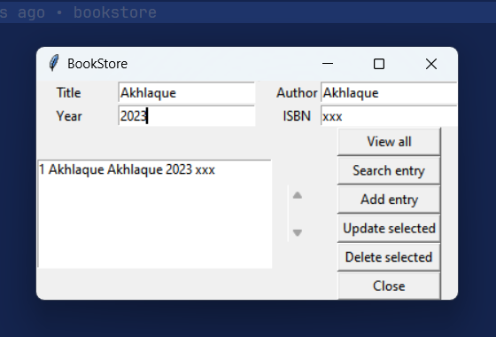

This is a simple Tkinter-based bookstore application that allows users to perform CRUD operations (Create, Read, Update, Delete) on a SQLite database containing book records. Users can add new books, view all existing books, search for specific books by title, author, year, or ISBN, update book details, and delete books from the database. The application provides a user-friendly interface with entry fields for inputting book details and buttons for executing various commands. Additionally, it uses the backend.py module to interact with the SQLite database, providing functions for database connectivity and book management operations.
